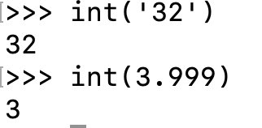
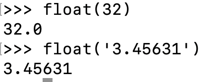
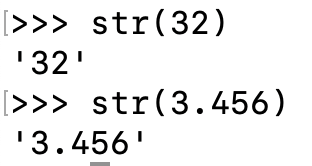

## Chapter 3. Functions

A function is a named sequence of statements that performs a computation. 

### 3.1 Function calls

The name of the function in this case, is type. 

The expression in parentheses is called the **argument** of the function. The reseult  for this function, is the type of the argument.

> It is common to say that a function `takes` an argument and `returns` a result. The result is also called the `return value`.

Python provides functions that convert values from one type to another.

- `int` function: can convert floating-point values to integers, but it doesn't round off.

- `float` function: converts integers and strings to floating-point numbers.

- str function: converts its argument to a string

### 3.2 Math functions

Python has a math module that provides most of the familar mathematical functions.

- Module: a file that contains a collection of related functions.
  - The module object containes the functions and varilabes defined in the module.
  - To access one of the functions, you have to sepcify the name of the module and the name of the function, seperated by a dot.
  - This format is called **dot notation.**

### 3.3 Composition

One of the most useful features of programming languages is the ability to take small building blocks and **compose** them.

For example, the argument of a function can be any kind of expression, including arithmetic operators, and even function calls:

Almost anywhere you can put a value, you can put an arbitrary expression, with one exception: the left side of an assignment statement has to be a **variable** name. Any other expressiono n the left side is a syntax error.

#### 3.4 Adding new functions

We have only been using the functions that come with Python, but it is also possible to add new functions.

**A function definition** specifies the name of a new function and the sequence of statements that run when the function is called.

- `def`: a keyword that indicates that this is a function definition.
  - The name of the function is `print_lyrics`.
  - The rules for function names are the same as for variable names.
- The **empty parentheses** after the name indicate that this function doesn't take any arguments.
- The first line of the function definition is called the **header**, and the rest is called the **body**.
  - The header has to end with a colon and the body has to be indented.
  - By convention, indentation is always four spaces.
- The string in the print statements are enclosed in double quotes. Most people use single quotes.
- All quotation marks must be "straight quotes", not "Curly quotes".
